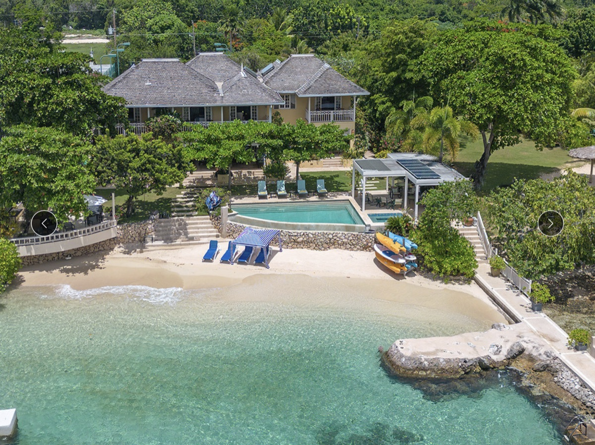
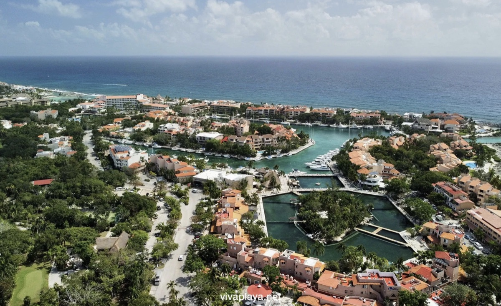
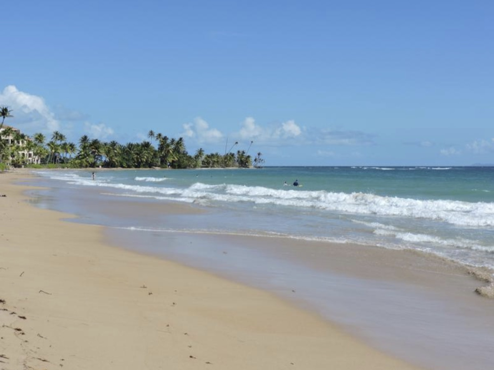

# Warm Christmas 2026 — (Claude's get-the-ball-rolling research)

Example dates: **Wednesday December 23 – Wednesday December 30, 2026** (7 nights)
How flexible are we if a specific house needs slightly different days?

Who: Chris & Nan, Grace & Corey & Emerson, Andrew & Chelsea & Hayden & Finley & Avery
(Grandmaria & Grandpa John maybe?)

The plan: one big house with a pool, warm ocean, everyone under one roof, family
cooking, some restaurants. We could consider resorts/clubs too, but Claude found houses.

Nonstop flights for everybody.

## The three example locations

| | Jamaica (north coast) | Riviera Maya (Puerto Aventuras, MX) | Puerto Rico (Palmas del Mar) |
| --- | --- | --- | --- |
| December weather | 84°F, ocean 82°F | 82°F, ocean 79°F | 83°F, ocean 81°F |
| Flight from NYC | 4h nonstop (Delta) | 4h15 nonstop (Delta) | 3h50 nonstop (Delta) |
| Flight from Chicago | 4h nonstop (American) | 3h45 nonstop (American) | 4h50 nonstop (American) |
| Flight from Charlotte | 3h nonstop | 3h nonstop | 3h30 nonstop |
| The house | Staffed villa — comes with a cook & housekeeper | Big villa in a gated marina town | Big villa in a gated resort community |
| Walk to shops/restaurants | No — private compound, we'd drive | Yes — marina, shops, restaurants | Sort of — restaurants & market inside the resort |
| Passports | Needed | Needed | **Not needed** — it's the US |
| Feel | Lush, green, laid-back | Beach town, snorkeling, cenotes | Easiest logistics, US groceries |

Example houses (just to give the flavor — we'd do further research):

- Jamaica: [Sugar Bay on the Beach, Discovery Bay — 5BR, beachfront, full staff](https://www.jamaicavillas.com/villa/jamaica/discovery-bay/sugar-bay-on-the-beach)
- Riviera Maya: [Villa Ohana, Puerto Aventuras — 7BR oceanfront, walk to marina](https://villaexperience.com/puerto-aventuras-2/)
- Puerto Rico: [Villa Bellamar, Palmas del Mar — 8BR oceanfront, crib & bunk room](http://www.villabellamar.com/About-Vacation-Rental-Puerto-Rico.html)

All three have calm, kid-friendly beaches, room for naps and early bedtimes, and
a real kitchen for family cooking (Jamaica adds a cook who does it for us —
we can still take over the kitchen whenever we want).

## Next steps

1. Dates
2. Locations, lodging
3. Passports (except Puerto Rico)

## Jamaica

[Sugar Bay on the Beach](https://www.jamaicavillas.com/villa/jamaica/discovery-bay/sugar-bay-on-the-beach) — Discovery Bay: private beach cove, pool, kayaks, and a staff that cooks.

## Riviera Maya, Mexico

[Villa Ohana](https://villaexperience.com/puerto-aventuras-2/) — Puerto Aventuras: oceanfront in the gated marina town, walk to shops and restaurants.

## Puerto Rico

[Villa Bellamar](http://www.villabellamar.com/About-Vacation-Rental-Puerto-Rico.html) — Palmas del Mar: oceanfront in the gated resort community.

