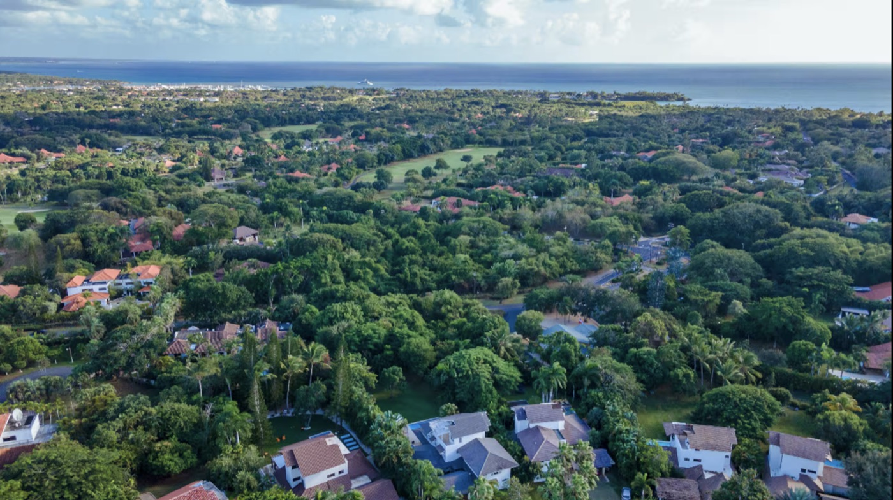
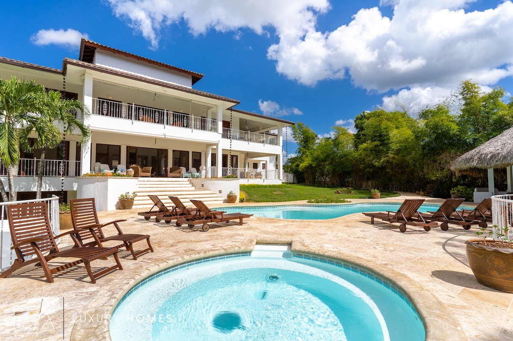
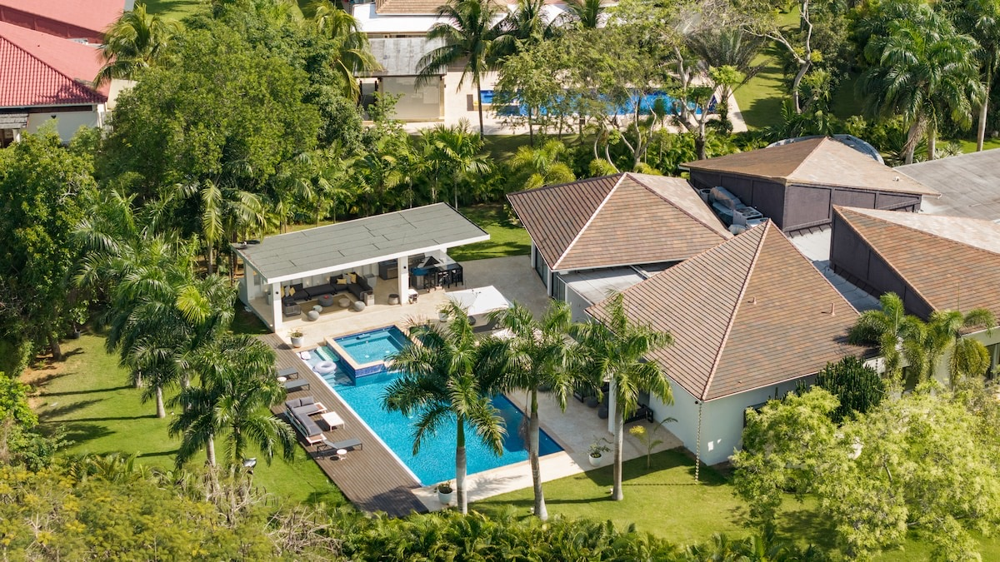
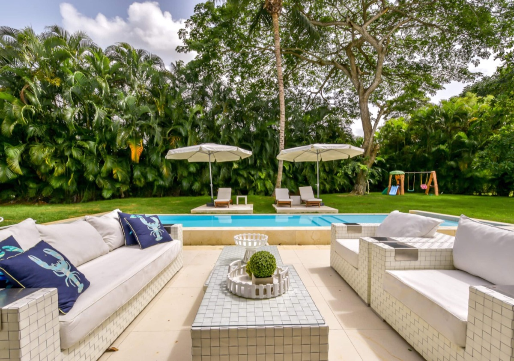
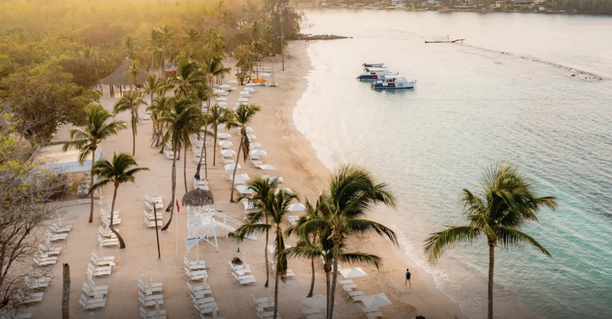

# Warm Christmas 2026 — Dominican Republic

**Dates:** Tuesday, December 22 – Tuesday, December 29, 2026 (7 nights).
Flexible by a day if a villa needs it (Wed Dec 23 – Wed Dec 30 also works).

**The plan:** one big villa with a pool and a calm beach, everyone under one roof,
a private chef plus our own family cooking, in a safe gated community. We looked
hard at Jamaica, Mexico, Puerto Rico, and Turks & Caicos — and chose the
**Dominican Republic** for its gated villa communities and easy nonstop flights.

## What the area looks like

An overhead look at Casa de Campo — a 7,000-acre gated resort of private villas
wrapped around golf, a marina, and its own calm Caribbean beach.

## Two resort areas — Casa de Campo & Cap Cana (near Punta Cana)

| | Casa de Campo (La Romana) | Cap Cana (Punta Cana) |
| --- | --- | --- |
| The beach | **Minitas** — a sheltered bay, flat calm water, made for little kids | **Juanillo** — long, powdery, calm aquamarine |
| The setup | A gated resort of private villas: 24/7 security, golf carts, marina, restaurants, and the Altos de Chavón village | A gated community of private villas with beach clubs, golf, and a marina |
| Family activities | **Strongest** — kids' clubs from age 1, a beach playground, pony rides, tennis, more | Great beach + Scape Park (a nearby adventure park) |
| Getting there | Everyone flies into Punta Cana, then about a one-hour transfer to the resort | Everyone flies into Punta Cana, 15–20 min from the villa |

We're **leaning Casa de Campo** for the sheer variety of things for the kids to
do. The one trade-off is the airport: everyone flies into Punta Cana, and Casa de
Campo is about an hour's drive from there — versus 15–20 minutes for Cap Cana.

## AirBnB vs travel agent or the resort

These are in [our Airbnb Wish List](https://www.airbnb.com/wishlists/2114716616)
There are a lot of houses offered on AirBnB. (Many don't have reviews for some reason.)

We could also inquire [directly from the resort](https://www.casadecampo.com.do/villas/). Corey also knows a travel agent who offered to help us.

**One thing to weigh:** how much of the week do we picture spending *at the house*
— pool, grounds, cooking, kids' naps and early bedtimes — versus running back and
forth to the beach? Some of the further houses are a half-hour walk to the beach (say, ~15 minutes by golf cart). Others are closer.

## The villas' outdoor space

The houses generally have generous *outdoor living* — large covered lounge-and-dining pavilions, big pools, and wide sun decks and some yard.

*Example: Villa Serenza — the covered lounge, pool, and deck (you can see a neighboring villa just beyond the trees).*

*Example: a back yard with a pool and a kids' swing set.*

## Minitas Beach, Casa de Campo

## Family activities at Casa de Campo

- **Kids' clubs from age 1** — Toddlers 'N Casa (1–3), Kidz 'N Casa (4–7), and up:
  playground time, arts & crafts, puppet shows, treasure hunts, pony rides, kayaking.
- **Minitas Family Pool & playground** — kids' pools, a playground with slides and
  a toddler climbing wall, an ice-cream parlor, and a food-truck corner.
- **Around the resort** — horseback and pony rides, tennis, and the clifftop
  **Altos de Chavón** village with restaurants and an amphitheater.

More detail and a full family guide are in the planning notes; an overview is
[Casa de Campo for Families](https://caribbeanparadisehomes.com/casa-de-campo-for-families/).

## Flights

Everyone flies nonstop into **Punta Cana (PUJ)** — there's no nonstop into the
airports closer to Casa de Campo, so PUJ is the gateway for all of us. For Cap
Cana the villa is 15–20 minutes away; for Casa de Campo it's about a one-hour
private transfer. Full schedules and options: [Dominican Republic flights](xmas2026-flights-dr).
